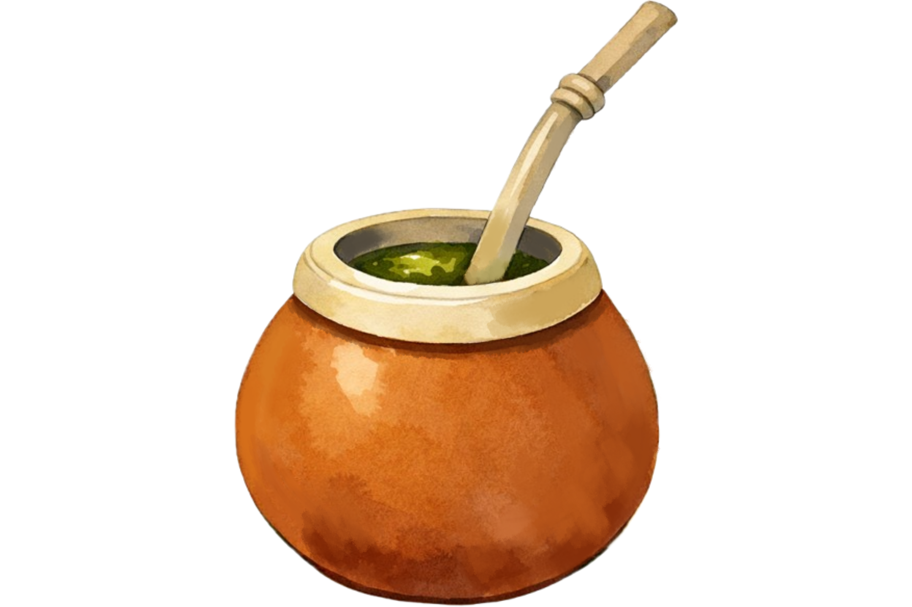
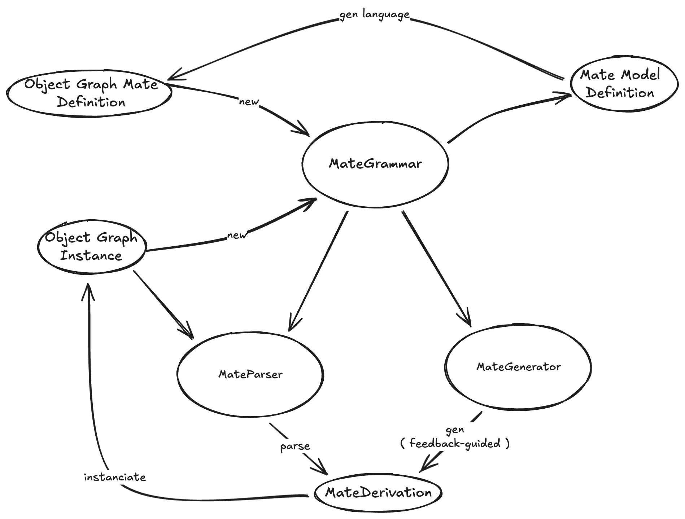

<p align="center">
  
</p>

# Mate - Object Graph Language

Mate is an object graph language implementation that allows you to define grammars representing software system structures and generate valid object instances from those grammars. To know more about Mate:

- [Mate Language](https://github.com/FedeLoch/Mate/wiki/Mate-Language)
- [Mate Grammar Examples](https://github.com/FedeLoch/Mate/wiki/Grammar-Examples)
- [How Mate Works](https://github.com/FedeLoch/Mate/wiki/How-Mate-Works)
- [Derivation Model](https://github.com/FedeLoch/Mate/wiki/Derivation-Model)
- [Object Graph Fuzzing](https://github.com/FedeLoch/Mate/wiki/Fuzzing)
- [Object Graph Parsing](https://github.com/FedeLoch/Mate/wiki/Parsing)
- [Object Graph Type Validation](https://github.com/FedeLoch/Mate/wiki/Object-Graph-Type-Validation)
- [Dynamic Grammar Generation by Test Suites](https://github.com/FedeLoch/Mate/wiki/Dynamic-Grammar-generation-by-Test-Suites)

## Architecture Overview

Mate is built on a systematic grammar-driven framework that decouples structural definitions from object instances or a Mate definition, enabling the generation of complex, state-consistent object graphs. It employs a feedback-oriented derivation process, where the object grammar productions are iteratively refined based on any kind of metric.



## Quick Start

```Smalltalk
Metacello new
    baseline: 'Mate';
    repository: 'github://FedeLoch/Mate:main';
    onConflictUseIncoming;
    load.
```

## Examples


### `Person` Object Graph Grammar:

```smalltalk
Person -> { age: Age }
Age -> { value: SmallInteger }
```

Generating Person instances:

```smalltalk
grammar := MatePersonGrammar new.
person := grammar gen: Person.

person age.  "=> 42 (random SmallInteger)"
```

### `Player` Object Graph Grammar:

```smalltalk
Player -> {
			name: String,
			characterClass: Warrior | Rogue | Mage,
			level: { type: SmallInteger, between: 0 and: 99 },
			missingExperienceForNextLevel: { type: SmallInteger, greaterThan: 0 }
		}
```

Generating player instances:

```smalltalk
grammar := MatePlayerGrammar new.
player := grammar gen: Player.

player name.            "=> 'xyz123'"
player characterClass.  "=> a Warrior"
player level.           "=> 47 (always 0-99)"
```

### `Bloc Element` Object Graph Grammar

```smalltalk
	BlElement -> {
		children: BlChildrenArray,
		visuals: BlCustomVisuals,
		constraints: BlLayoutCommonConstraints
	}.
		
    BlChildrenArray -> { 
        array: { type: [ BlElement ], sizeBetween: 0 and: 30 }
    }.
    
    BlCustomVisuals -> { 
        background: (BlPaintBackground | BlTransparentBackground),
        geometry: (BlRectangleGeometry | BlEllipseGeometry | BlTriangleGeometry),
        clipChildren: Boolean,
    }.
    
    BlLayoutCommonConstraints -> {
        position: Point,
        vertical: BlLayoutCommonConstraintsAxis,
        horizontal: BlLayoutCommonConstraintsAxis
    }.
    
    BlLayoutCommonConstraintsAxis -> {
        resizer: BlLayoutExactResizer
    }.
    
    BlLayoutExactResizer -> {
        size: SmallInteger
    }.
    
    BlPaintBackground -> {
        paint: Color
    }.
    
    BlTriangleGeometry -> {
        orientation: { oneOf: { #top . #right . #left . #bottom } }
    }
```

Generating Bloc Element instances:

```smalltalk
grammar := MateBlocGrammar new.
element := grammar gen: BlElement.
```

### Backpropagation

Propagate rewards through the derivation tree to improve future generations:

```smalltalk
grammar := MatePlayerGrammar new.
derivationTree := grammar gen: Player from: MateContext new.
player := derivationTree instance.

"Propagating feedback for future generations"
grammar backpropagate: derivationTree improvement: 42.
```
